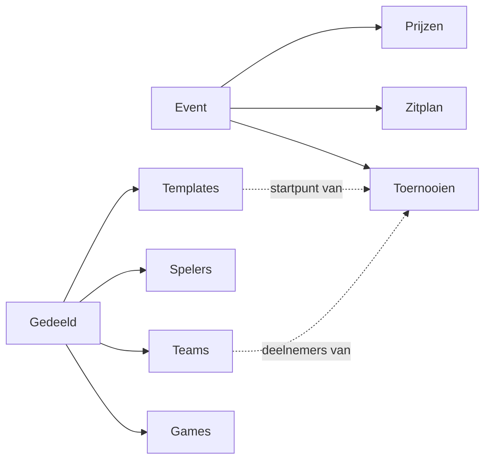
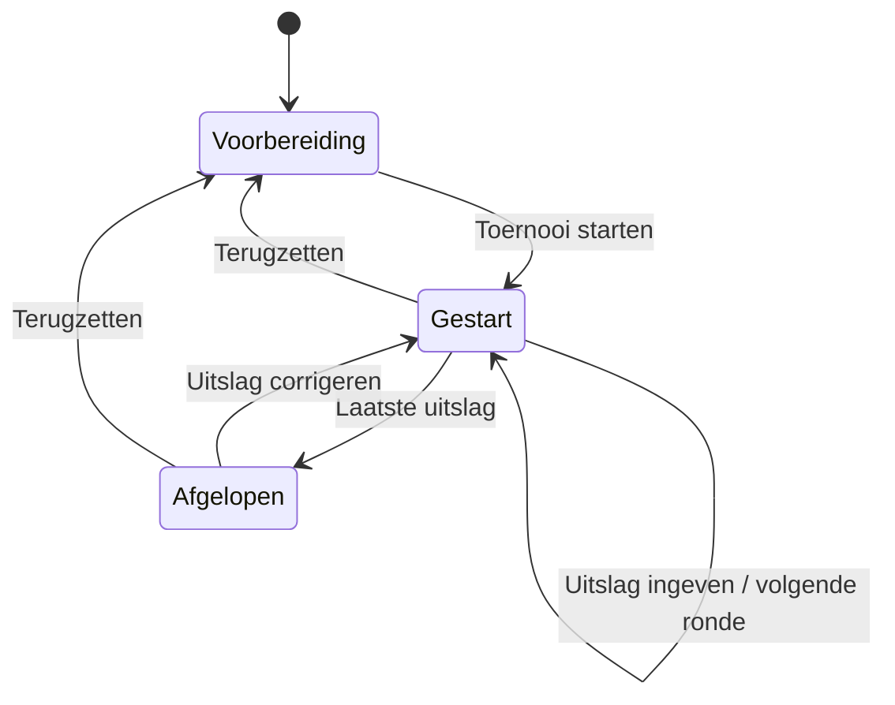
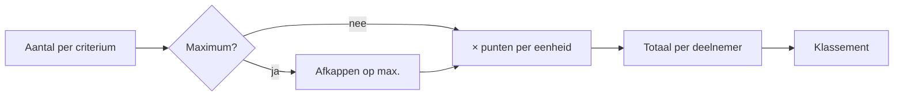
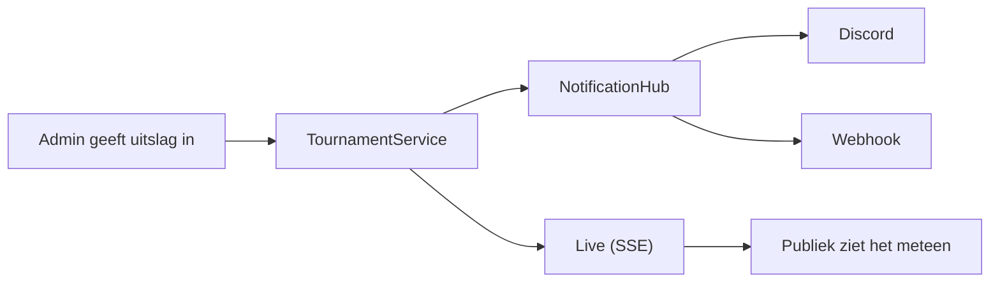
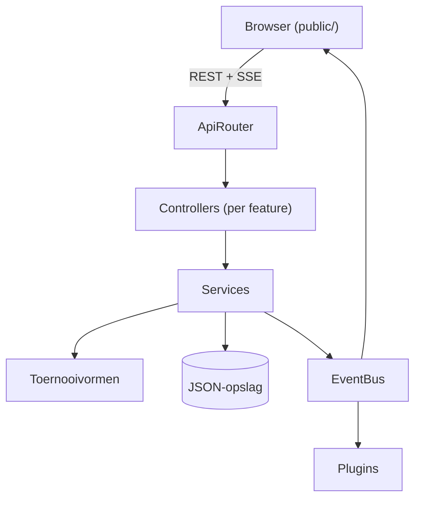

<div align="center">

# VIVES LAN-portaal

**Brackets, klassementen, zitplan en prijzen: alles live op je beamer.**


</div>

Met dit portaal organiseer je een complete LAN-party: edities (events), toernooien vanuit templates,
live brackets en klassementen, games, teams, spelers, zitplan, prijzen/shop en Discord-meldingen.
Alleen admins melden aan; het publiek ziet alles live bijwerken. Handig op een beamer in de zaal.

> Het portaal werkt **volledig offline** op het LAN-netwerk: lettertypes en alle bestanden worden lokaal gehost.

---

## Wat kan het?

| Onderdeel | Omschrijving |
|---|---|
| **Toernooien** | Knock-out, double elimination, competitie, poules, Swiss, puntentoernooi en scorebord |
| **Live** | Elke uitslag verschijnt meteen bij iedereen (Server-Sent Events) |
| **Events** | Elke editie heeft eigen toernooien, zitplan en prijzen, met een aftelling op de startpagina |
| **Zitplan** | Zones als raster, bezoekers zoeken hun plaats |
| **Prijzen & shop** | Prijzenlijst per event |
| **Plugins** | Discord-embeds en algemene webhooks |
| **PWA** | Installeerbaar op telefoon of desktop |

---

## Snel starten (Docker)

```bash
cp .env.example .env        # vul ADMIN_PASSWORD en JWT_SECRET in
docker compose up -d --build
```

| Wat | Waar |
|---|---|
| Publieke site | `http://<server>:3000` |
| Beheer | `http://<server>:3000/admin` (of de knop **Beheer** rechtsboven) |
| Data | volume `lan-data` (`/app/data`, JSON-bestanden). Back-up = die map kopiëren |

Het eerste admin-account komt uit `.env`. Je beheert admins daarna onder **Beheer → Admins**.

### Instellingen (`.env`)

| Variabele | Betekenis |
|---|---|
| `PORT` | Poort waarop het portaal luistert (standaard `3000`) |
| `ADMIN_USERNAME` / `ADMIN_PASSWORD` | Eerste admin, enkel aangemaakt als er nog geen admins bestaan |
| `JWT_SECRET` | Lange willekeurige string, bv. `openssl rand -hex 32` |
| `DATA_DIR` | Map waar de JSON-data staat |
| `COOKIE_SECURE` | `true` als het portaal achter HTTPS draait |
| `PUBLIC_URL` | Publiek adres, voor links in Discord-berichten (optioneel) |

> Achter een reverse proxy met HTTPS: zet `COOKIE_SECURE=true` en laat de proxy `/api/live`
> niet bufferen, bv. in nginx `proxy_buffering off;`.

---

## Lokaal ontwikkelen

```bash
npm install
ADMIN_PASSWORD=geheim123 npm run dev
npm test                    # test alle toernooivormen
```

---

## Events (LAN-edities)

Elke editie (bv. *"VIVES LAN Herfst 2026"*) heeft eigen toernooien, zitplan en prijzen.
**Games, teams, spelers en templates zijn gedeeld**, zodat je ze niet telkens opnieuw invoert.
Een team is niet aan één game gebonden en kan in elk toernooi meedoen.

| Onderwerp | Hoe het werkt |
|---|---|
| Actief event | Er is altijd één actief event: dat toont de publieke site met een aftelling tot de start |
| Oude edities | Bezoekers bekijken ze via de keuzelijst bovenaan |
| Beheer | Bovenaan kies je aan welk event je werkt |
| Eerste event | Neemt alle bestaande toernooien, plaatsen en prijzen over |
| Verwijderen | Een event met inhoud kan niet per ongeluk verwijderd worden |



---

## Toernooivormen

| Vorm | Wat |
|---|---|
| Single elimination | Knock-out, byes automatisch, optionele kleine finale |
| Double elimination | Winners- en losers-bracket, grand final met optionele reset |
| Round robin | Iedereen tegen iedereen, heen/terug instelbaar, eigen puntensysteem |
| Poules + knock-out | Slangseeding in poules, daarna knock-out met de besten per poule |
| 🇨🇭 Swiss | Koppeling op punten zonder herkansingen, Buchholz als tiebreak |
| Puntentoernooi | Free-for-all (battle royale, racing): punten per plaats + bonus (kills) |
| Scorebord | Vrije punten: de admin kent zelf punten toe per criterium |

Templates bewaren een vorm met instellingen (best of, puntentabel, aantal poules...). Bij een nieuw
toernooi kies je een template.

| Fase | Wat kan je aanpassen? |
|---|---|
| Voorbereiding | Instellingen, deelnemers en seeding |
| Gestart | Namen van deelnemers; uitslagen corrigeren zolang de volgende match niet gespeeld is |
| Afgelopen | Uitslagen corrigeren of het toernooi terugzetten naar de voorbereiding |



### Scorebord in detail

Voor alles wat geen wedstrijd is: social media-acties, aanwezigheid, bonusopdrachten...

| Onderdeel | Uitleg |
|---|---|
| Criteria | Bv. *Social gelikt* (5 punten per eenheid) of *Social gevolgd* (3 punten, max. 1) |
| Aantal | Per deelnemer geef je het aantal in; het portaal rekent aantal × punten per eenheid uit |
| Maximum | Kapt het aantal af, zodat niemand eindeloos punten kan sprokkelen |
| Aanpasbaar | Criteria wijzig je altijd, ook tijdens het toernooi. Verwijderde criteria wissen hun punten |
| Publiek | Klassement met een kolom per criterium |
| Afsluiten | **Toernooi afsluiten** en **Heropenen** |
| Startcriteria | In de template als `naam=punten; naam=punten` |



---

## Plugins

Onder **Beheer → Plugins**. Per plugin kies je aan/uit en welke meldingen hij stuurt:
event actief, toernooi gestart, elke uitslag, winnaar.

| Plugin | Wat doet ze? | Instellen |
|---|---|---|
| Discord | Post embeds in een kanaal via een webhook, geen bot nodig. Mentions staan uit | Kanaalinstellingen → Integraties → Webhooks → Nieuwe webhook → URL kopiëren. Zet `PUBLIC_URL` in `.env` voor correcte links |
| Algemene webhook | Elke melding als JSON naar een eigen URL (eigen bot, n8n, Home Assistant...) | Optioneel ondertekend met HMAC-SHA256 in `X-Lan-Signature` |

Webhook-URL's en geheimen gaan nooit terug naar de browser. Een event krijgt ook een Discord-uitnodiging
die als knop op de publieke site verschijnt.



---

## Structuur

```
src/
  core/            gedeelde bouwstenen (opslag, validatie, generieke CRUD, live-events)
  features/        één map per domein
    auth/ admins/ events/ games/ players/ teams/ prizes/ seats/ templates/
    plugins/
      Plugin.js               abstracte basis voor integraties
      PluginRegistry.js       alle plugins geregistreerd
      NotificationHub.js      stuurt domeinmeldingen door naar ingeschakelde plugins
      discord/ webhook/
    tournaments/
      formats/
        TournamentFormat.js     abstracte basisklasse
        FormatRegistry.js       alle vormen geregistreerd
        elimination/ league/ points/ scoreboard/ shared/
  app/             Container (dependency injection), App en ApiRouter
public/
  css/             fonts, base, layout, tournament, event (gamer-stijl: VIVES-rood vs cyaan)
  fonts/           Chakra Petch + Barlow (lokaal, OFL-licentie)
  js/core/         DOM-helper, API, router, live, formulieren
  js/views/        bracket, klassement, zitplan, prijzen (gedeeld publiek/admin)
  js/public/       publieke pagina's
  js/admin/        beheerpagina's (+ resources/ met configuratie per entiteit)
tests/             tests voor de toernooi-engine
```



### Uitbreiden

| Wat toevoegen? | Backend | Frontend |
|---|---|---|
| Toernooivorm | Klasse die `TournamentFormat` uitbreidt (`key`, `label`, `settingsFields`, `create`, `report`, `standings`, eventueel `advance`/`canAdvance`) en registreren in `FormatRegistry.defaults()` | Instellingen verschijnen vanzelf in het template-formulier |
| Nieuw soort item | Service die `CrudService` uitbreidt met een `Schema`, plus één regel in `ApiRouter` | Resource-config in `public/js/admin/resources/` en één route in `admin/main.js` |
| Plugin | Klasse die `Plugin` uitbreidt (`ownFields`, `send(message, settings)`) in `src/features/plugins/` en registreren in `PluginRegistry` | Instellingenformulier verschijnt vanzelf |

---

## API (kort)

Alle `GET`-routes zijn publiek (gevoelige velden zoals e-mail worden verborgen), schrijven vereist een admin.

| Route | Doel |
|---|---|
| `POST /api/auth/login`, `POST /api/auth/logout`, `GET /api/auth/me` | Aanmelden |
| `/api/games`, `/players`, `/teams`, `/prizes`, `/seats`, `/templates` | CRUD |
| `POST /api/seats/grid` | Zone als raster aanmaken |
| `GET /api/templates/formats` | Beschikbare vormen en hun instellingen |
| `/api/tournaments` | CRUD, plus `PUT /:id/participants`, `POST /:id/start`, `POST /:id/advance`, `POST /:id/reset`, `GET /:id/standings` |
| `POST /api/tournaments/:id/matches/:matchId/result` | Uitslag ingeven. Bij een scorebord is `matchId` de actie: `scores`, `criteria` of `status` |
| `/api/events` | CRUD, plus `GET /current` en `POST /:id/activate` |
| `/api/plugins` (admin) | `GET`, `PUT /:key`, `POST /:key/test` |
| `GET /api/live` | Server-Sent Events bij elke wijziging |

Lijsten van toernooien, plaatsen en prijzen filter je met `?eventId=...`.

---

<div align="center">

Gemaakt voor de VIVES LAN-party's · Veel plezier en **GG!**

</div>
